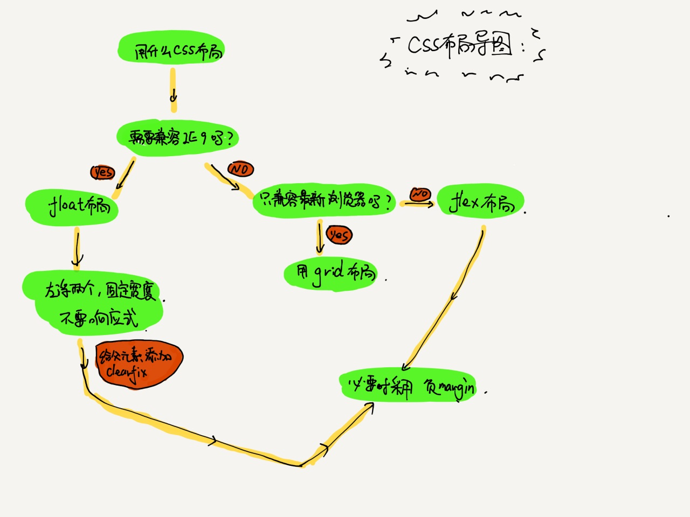

css 布局主要分为两种类型：

1. 固定宽度布局：一般宽度为 960、1000、1024px，一般用于 pc 页面。
2. 不固定宽度布局：根据文档流原理自动布局，一般应用于手机页面。
   （响应式布局：在 pc 上为固定宽度，在手机上则不固定。）
   **注意：文档流本来就是自适应，不需要加额外的样式。**

布局的思路：

- 对于老手来说，一般按从大到小设计，先确定大局，后完善每个小部分的布局。
- 对于新手来说，一般按从小到大设计，先完成小布局，然后将多个小布局组合成为大布局。

关于使用哪种布局，具体情况要看需求，根据所学整理出一张思维导图：

布局是前端学习过程中一个非常重要的部分，学习的时候一定要细心。
